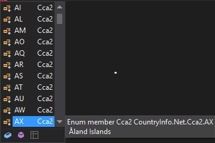

# CountryInfo.Net

[](https://ci.appveyor.com/project/vertigra/countryinfo-net)

## How to use

### Code ISO 3166-1 alpha-2
Use the **Cca2** enumeration to get the country code **iso 3166-1 alpha-2**. The name of the country is written in the commentary:



### Code ISO 3166-1 numeric
Use the **Ccn3** enumeration to get the country code **ISO 3166-1 numeric**.

```c#
Console.WriteLine("Country code " + Ccn3.Bahrain + " is " + (int)Ccn3.Bahrain)
Console.WriteLine("Country code " + Ccn3.Bahrain + " is " + ((int)Ccn3.Bahrain).ToString("000"));

/* Output:
   Country code Bahrain is 48
   Country code Bahrain is 048
*/

```


## Thanks

The logo is provided by the site [icons8.com](https://icons8.com/)
